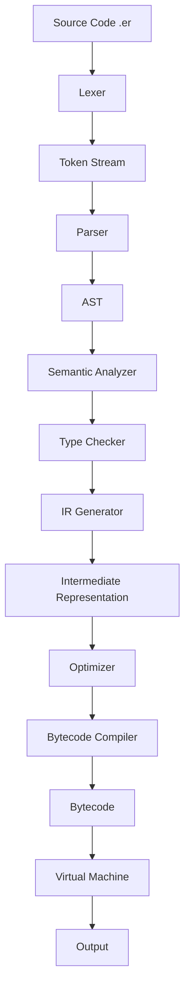
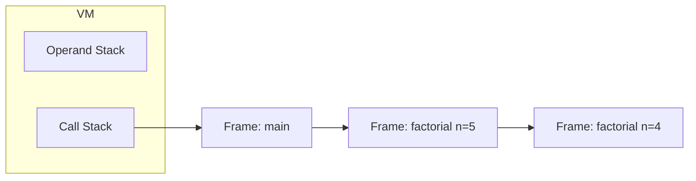

# EramLang

A small, real programming language and compiler, built from scratch in Rust.

EramLang has its own lexer, recursive-descent parser, AST, semantic analyzer,
static type checker, intermediate representation, optimizer, bytecode
compiler, stack-based virtual machine, standard library, REPL, CLI, and a
basic bytecode-level debugger. Every EramLang program you run goes through
the full pipeline below — there is no shortcut interpreter hiding behind the
scenes.

```eram
fn factorial(n: int) -> int {
    if n <= 1 {
        return 1;
    }
    return n * factorial(n - 1);
}

let result: int = factorial(5);
print(result); // 120
```

## Why EramLang exists

This project exists to demonstrate, end to end, how a real (if small)
compiler is built: lexical analysis, parsing, semantic analysis, static
typing, an independent IR, bytecode generation, a virtual machine, and the
tooling (REPL, CLI, debugger, diagnostics, optimizer) that surrounds a
language in practice. It is deliberately kept small enough to read in an
afternoon, while every stage is real — nothing is faked or skipped.

## Language features

- **Variables**: `let`, `let mut`, and shadowing (`let x = 10; let x = x + 20;`)
- **Primitive types**: `int`, `float`, `bool`, `string`, `char`, `void`, with static type checking
- **Operators**: full arithmetic/comparison/logical set with correct precedence, plus `+= -= *= /=`
- **Control flow**: `if`/`else`, `while`, `for i in a..b`, `break`, `continue`
- **Functions**: parameters, return values, recursion, nested calls
- **Arrays**: literals, indexing, mutation, `len`/`push`/`pop`
- **Strings**: concatenation, indexing, `len`
- **Structs**: declarations, literals, field access and mutation
- **Enums & pattern matching**: `enum` + `match`, with exhaustiveness *warnings*
- **Comments**: `// line` and `/* block */`
- **Diagnostics**: `rustc`-style errors with file:line:column, source snippet, caret, and help text

## Architecture



Every stage is a separate Rust module with a narrow, typed interface to the
next stage — see [`docs/architecture.md`](docs/architecture.md) for the full
breakdown of what lives where and why.

One deliberate simplification, documented here rather than hidden: semantic
analysis and static type checking are implemented as a single walking pass
(`src/semantic.rs`) rather than two separate tree traversals, since they
share the same scope/symbol-table bookkeeping. The IR, optimizer, and
bytecode compiler are genuinely separate stages with their own data types
(see [`docs/bytecode.md`](docs/bytecode.md) and
[`docs/compiler.md`](docs/compiler.md)).

## Installation

Requires Rust (stable) and Cargo.

```bash
git clone <this-repo>
cd eramlang
cargo build --release
```

The compiled binary is at `target/release/eram`.

## Compiling and running programs

```bash
eram run examples/hello.er        # compile + execute
eram build examples/hello.er      # type-check and compile only
eram check examples/hello.er      # semantic analysis + type checking only
eram dump-ast examples/hello.er   # print the parsed AST
eram dump-ir examples/hello.er    # print the intermediate representation
eram dump-bytecode examples/hello.er  # print the compiled bytecode
eram debug examples/factorial.er  # step through with the debugger
eram version                      # print version info
```

## REPL

```bash
$ eram repl
EramLang 0.1.0
>>> let x = 10
>>> x + 20
30
>>> let name = "Eram"
>>> print(name)
Eram
>>> exit
```

Multiline blocks are supported — the REPL keeps reading until braces
balance:

```
>>> fn double(n: int) -> int {
...     return n * 2;
... }
>>> double(21)
42
```

The REPL uses a small tree-walking evaluator (`src/interpreter.rs`) rather
than the bytecode VM, so it can evaluate one statement at a time against a
growing session without re-deriving fixed stack-slot layouts on every
keystroke. `eram run`/`eram build` and the whole test suite exercise the
*real* lex → parse → semantic → IR → bytecode → VM pipeline; see
[`docs/architecture.md`](docs/architecture.md) for the rationale.

## Examples

| File | What it shows |
|---|---|
| [`examples/hello.er`](examples/hello.er) | Minimal program |
| [`examples/factorial.er`](examples/factorial.er) | Recursion |
| [`examples/fibonacci.er`](examples/fibonacci.er) | Recursion + `while` |
| [`examples/arrays.er`](examples/arrays.er) | Arrays and the array stdlib |
| [`examples/structs.er`](examples/structs.er) | Structs, enums, `match` |
| [`examples/loops.er`](examples/loops.er) | `while`, `for`, `break`, `continue` |
| [`examples/errors.er`](examples/errors.er) | A clean runtime error (array bounds) |
| [`examples/final_demo.er`](examples/final_demo.er) | Everything together |

## Compiler pipeline

1. **Lexer** (`src/lexer.rs`) — hand-written, byte-at-a-time scanner producing `Token`s with line/column info.
2. **Parser** (`src/parser.rs`) — hand-written recursive-descent parser with precedence climbing for expressions. No parser-generator framework.
3. **AST** (`src/ast.rs`) — typed tree: `Program`, `Item`, `Statement`, `Expr`, etc.
4. **Semantic analysis + type checking** (`src/semantic.rs`, `src/types.rs`) — scope resolution, undefined-variable/duplicate-declaration/invalid-control-flow checks, and static type checking, in one pass over the AST that never executes the program.
5. **IR generation** (`src/compiler.rs::IrGen`, `src/ir.rs`) — lowers the AST into a symbolic, stack-based IR that addresses locals by name and jumps by label, independent of both the tree shape of the AST and the flat layout of bytecode.
6. **Optimizer** (`src/optimizer.rs`) — constant folding, local constant propagation, and dead-code elimination, as composable passes over the IR.
7. **Bytecode compiler** (`src/compiler.rs::CodeGen`) — lowers IR into `bytecode::Instr`, resolving labels to jump offsets and local names to stack-slot indices.
8. **Virtual machine** (`src/vm.rs`) — stack-based VM with an operand stack, a call stack of frames (each with its own locals and instruction pointer), and a full runtime-error model (never panics on a malformed *language* program).
9. **Standard library** (`src/stdlib.rs`) — `print`, `println`, `input`, `len`, `push`, `pop`, `sqrt`, `abs`, `min`, `max`, implemented against `Value` only (no knowledge of the AST/bytecode).

## Bytecode architecture

See [`docs/bytecode.md`](docs/bytecode.md) for the full instruction set.
Example:

```eram
let x = 10 + 20;
print(x);
```

compiles (after constant folding) to:

```
Const(0)          ; constants[0] = 30
StoreLocal(0)
LoadLocal(0)
CallBuiltin("print", 1)
```

## VM architecture

The VM is a classic stack machine: an operand `Vec<Value>`, a call stack of
`Frame`s (function index, instruction pointer, local-variable slots), and a
`step()` function that executes exactly one instruction. `eram debug` drives
this `step()` loop directly to single-step a running program.



## Performance benchmarks

Measured with `cargo run --release --bin bench` on the machine this project
was built on (numbers will vary by hardware; run it yourself to reproduce):

| Workload | Compilation | Execution | Instructions |
|---|---|---|---|
| `while` loop, 1,000 iterations | 0.03 ms | 0.28 ms | 13,015 |
| `while` loop, 10,000 iterations | 0.02 ms | 3.19 ms | 130,015 |
| `while` loop, 100,000 iterations | 0.02 ms | 26.8 ms | 1,300,015 |
| `while` loop, 1,000,000 iterations | 0.02 ms | 271.5 ms | 13,000,015 |
| `fibonacci(20)` (recursive) | 0.09 ms | 6.4 ms | 218,914 |
| `fibonacci(25)` (recursive) | 0.03 ms | 70.2 ms | 2,427,854 |
| `fibonacci(27)` (recursive) | 0.06 ms | 165.9 ms | 6,356,214 |

Run `cargo run --release --bin bench` to reproduce or extend these numbers
(lexer/parser/compiler throughput, array operations, and function-call
overhead are all covered).

## Roadmap

- **v0.1** (this release): full pipeline, core language, stdlib, REPL, CLI, basic debugger and optimizer.
- **v0.2**: proper closures/upvalues, richer pattern matching (data-carrying enum variants), a real source-map so runtime errors report exact line/column instead of function name.
- **v0.3**: module system (`import`), generics, a bytecode disassembler/serializer (`serde`-based `.erc` files) so `eram build` produces a real artifact `eram run` can load without recompiling.
- **v1.0**: stabilized language grammar, backward-compatible bytecode format.

The IR/bytecode split and the modular optimizer pass list were designed
specifically so these can land without restructuring the pipeline.

## Testing

```bash
cargo test
```

- **Unit tests** live next to the code they test (`#[cfg(test)]` modules in
  `src/lexer.rs`, `src/parser.rs`, `src/vm.rs`): lexer token streams, parser
  precedence/AST shape, VM arithmetic/calls/recursion/runtime errors.
- **Integration tests** (`tests/integration_tests.rs`) compile and run
  complete `.er` programs through the `eram` binary and assert on their
  actual stdout/stderr/exit code — including the exact final-demonstration
  program from the spec, type errors, semantic errors, and runtime errors.

Run the standard gate before committing:

```bash
cargo check
cargo test
cargo clippy   # if the clippy component is installed
cargo fmt --check
```

## Contributing

This is a from-scratch educational compiler; contributions that keep each
phase independent, avoid global mutable state, and add tests for new
behavior are welcome. Please run the test gate above before opening a PR.

## Project layout

```
eramlang/
├── Cargo.toml
├── src/
│   ├── lexer.rs        Lexer
│   ├── token.rs         Token types
│   ├── parser.rs        Recursive-descent parser
│   ├── ast.rs            AST node types
│   ├── semantic.rs      Semantic analysis + type checking
│   ├── types.rs          Type-compatibility rules
│   ├── ir.rs              Intermediate representation
│   ├── optimizer.rs     Constant folding / propagation / DCE
│   ├── compiler.rs      AST -> IR -> bytecode lowering
│   ├── bytecode.rs      Instruction set + Program/Function layout
│   ├── vm.rs              Stack-based virtual machine
│   ├── stdlib.rs         Standard library
│   ├── value.rs           Runtime `Value` type
│   ├── interpreter.rs   Tree-walking evaluator (REPL only)
│   ├── repl.rs             Interactive REPL
│   ├── debugger.rs       Bytecode-level debugger
│   ├── driver.rs          Wires every phase together
│   ├── errors.rs          Diagnostics (rustc-style error rendering)
│   ├── main.rs             CLI entry point
│   └── bin/bench.rs     Performance benchmark harness
├── examples/            Sample .er programs
├── tests/               Integration tests
└── docs/                 Architecture, bytecode, and compiler docs
```
