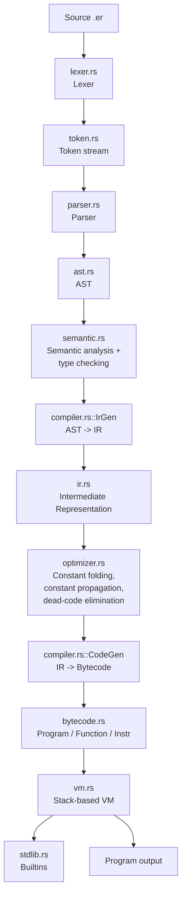

# Compiler Architecture

## Module responsibilities

| Module | Responsibility | Depends on |
|---|---|---|
| `token.rs` | Token/keyword definitions | nothing |
| `lexer.rs` | Source text -> `Vec<Token>` | `token`, `errors` |
| `ast.rs` | AST node types | nothing |
| `parser.rs` | `Vec<Token>` -> `ast::Program` (recursive descent, precedence climbing) | `ast`, `token`, `errors` |
| `semantic.rs` | Scope/type checking over the AST; produces `ProgramInfo` (function signatures, struct fields, enum variants) | `ast`, `types`, `errors`, `stdlib` |
| `types.rs` | Type-compatibility and arithmetic-result rules | `ast` |
| `ir.rs` | Symbolic IR types (`IrOp`, `IrProgram`) | `value` |
| `compiler.rs` (`IrGen`) | AST -> IR, resolving variable *names* to unique per-scope identifiers and control flow to symbolic labels | `ast`, `ir`, `semantic`, `stdlib` |
| `optimizer.rs` | Pure `Vec<IrOp> -> Vec<IrOp>` passes: constant folding, constant propagation, dead-code elimination | `ir`, `value` |
| `compiler.rs` (`CodeGen`) | IR -> `bytecode::Program`, resolving labels to jump offsets and names to stack-slot indices | `ir`, `bytecode` |
| `bytecode.rs` | Instruction set, `Function`/`Program` layout | `value` |
| `vm.rs` | Executes `bytecode::Program`; operand stack, call frames, runtime-error handling | `bytecode`, `value`, `stdlib` |
| `value.rs` | Runtime `Value` representation shared by VM, stdlib, and the REPL interpreter | nothing |
| `stdlib.rs` | Builtin function implementations | `value` |
| `driver.rs` | Wires every phase together into one `compile()` call | all of the above |
| `interpreter.rs` | Tree-walking evaluator used *only* by the REPL | `ast`, `value`, `stdlib` |
| `repl.rs` | Interactive shell built on `interpreter.rs` | `interpreter`, `lexer`, `parser` |
| `debugger.rs` | Single-steps the VM, breakpoints on function entry | `vm`, `bytecode` |
| `errors.rs` | `rustc`-style diagnostic rendering | nothing |
| `main.rs` | CLI (`clap`) | `driver`, `vm`, `repl`, `debugger` |

## Why IR is independent of the AST

The IR (`ir::IrOp`) is a flat, stack-oriented instruction stream — nothing
like the AST's nested tree. It **is** still a step above bytecode, though:
locals are addressed by *name* (`LoadLocal("x$3")`) rather than a resolved
stack slot, and control flow uses symbolic `Label`/`Jump` rather than
resolved jump offsets. This is what makes the IR a genuine separate stage:

- The optimizer (`optimizer.rs`) only has to reason about a linear
  instruction stream, not tree shape — constant folding is a simple
  peephole match on the last two emitted ops.
- Lowering to bytecode (`compiler::CodeGen`) is a single linear pass that
  resolves labels to offsets (first pass) and assigns slot indices to
  names (second pass) — it never needs to look back at the AST.
- Future optimization passes (e.g. common-subexpression elimination) can
  be added as another `Vec<IrOp> -> Vec<IrOp>` function without touching
  the parser or the VM.

## Why the REPL doesn't use the bytecode pipeline

Bytecode compilation resolves every local variable to a **fixed slot index
for a whole compiled function**. That's exactly wrong for a REPL, where the
"program" grows one statement at a time and earlier bindings must stay
alive and mutable across calls without renumbering. Rather than recompiling
and *replaying* the whole session (which would re-run earlier `print`
side effects on every keystroke), the REPL walks the AST directly against a
persistent environment (`interpreter.rs`). This is a deliberate, documented
scope boundary: `eram run`, `eram build`, `eram debug`, and the entire test
suite all exercise the real lex → parse → semantic → IR → bytecode → VM
pipeline; only the REPL's interactive convenience layer differs.
